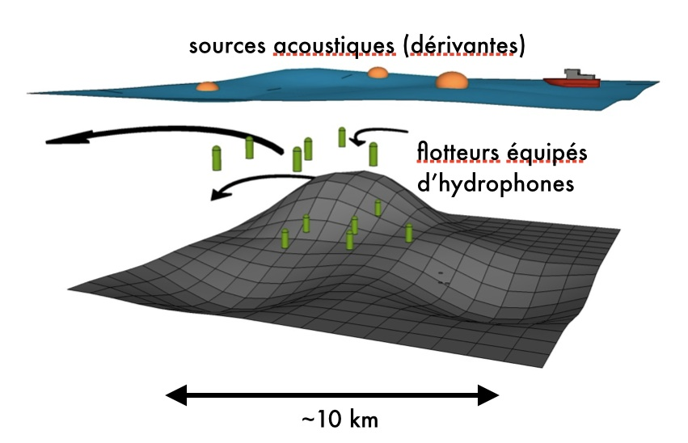

# sujet thèse cognac / sous-mésoéchelle et acoustique

# résumé

L'objectif de cette thèse est d'améliorer notre capacité à mesurer la circulation océanique de sous-mésoéchelle (fronts, filaments, ondes internes), de quantifier l'impact de cette circulation sur la propagation acoustique aux échelles <100km et de déterminer les moyens de mitiger cet impact grâce à des données physiques in situ et satellite. La thèse contribuera spécifiquement au développement d'un projet visant au développement d'un concept expérimental innovant basé sur le déploiement d'une nuée de flotteurs autonomes géolocalisés acoustiquement.

(contexte in situ/satellite=SWOT/SKIM, acoustique?)

## contexte

* physique/sous-mésochelle:

L’étude des mouvements océaniques fine échelle est actuellement au cœur d’une intense activité de recherche [Ferrari Science 2011, Callies et al. Nat. Commun. 2015]. Ces mouvements sont composés d’ondes internes (OI, périodes <1jour et taille <300km) et de mouvements plus lents dit « équilibrés » : les tourbillons mésoéchelle (périodes de plusieurs semaines et tailles comprises entre 50 et 300km) et les fronts et filaments sous-mésoéchelle (taille<50km, périodes allant de la journée à la semaine). Les tourbillons mésoéchelle jouent un rôle clé dans l’équilibre de l’océan aux échelles climatiques [McWilliams 2008]. Les mouvements à sous-mésoéchelle induisent eux une circulation verticale intense et contrôlent la déformation, la dispersion et les échanges entre l’océan intérieur et la surface de chaleur, sel, carbone et de nutriments [Omand et al. Science 2015]. D’un point de vue biogéochimique et écosystémique, la mésoéchelle et la sous-mésoéchelle (M/SM) conditionnent l’environnement dans lequel la vie prospère au sein de l’océan. Lors des 15 dernières années, l'Ifremer a contribué de manière significative à cet effort de recherche au travers de son implication au sein du Laboratoire d'Océanographie Physique et Spatiale (historiquement du LPO-LOS) et des travaux de modélisations et d'observations spatiale qui y ont été réalisés.

La plupart des travaux ayant démontré l’importance des OI et de la M/SM pour le fonctionnement physique/biogéochimique/climatique de l’océan se fondent sur des simulations numériques de haute résolution. La validation de ces résultats numériques grâce à des observations in situ et satellite reste un enjeu majeur des années à venir. Cet enjeu est tel que des missions satellite soient spécifiquement développées : Sentinel3, SWOT (altimétrie large fauchée, date de lancement en 2021). Ces observations satellite restent superficielles toute fois et ne manifestent qu’indirectement la dynamique océanique intérieure. L’observation in situ de la circulation fine échelle est donc nécessaire mais rendue compliquée par la rapidité des processus concernés et notre incapacité à obtenir une vision synoptique 3D de la circulation avec les moyens classiques (poissons remorqués, ADCP de coque). Des stratégies s’appuyant sur le déploiement de flotteurs dérivants, bas-coût et géolocalisés acoustiquement pourraient en revanche permettre une percée en la matière [Jaffe et al. 2016, Figure 1] en complémentarité avec les techniques classiques.

* acoustique:

	* Impact la circulation océanique de sous-mésoéchelle sur la propagation acoustique.	
	Duda14b: "These (internal) waves can focus energy [3-6], and can affect coherence [7-8], multipath interference [9], and reverberation [10]."
	
	* Mesure (avec un réseau de flotteurs) et utilisation du bruit ambiant pour la géocalisation (Naughton 2016, 2018)

	* Quelles frontières? Quelles autres utilités?

## objectifs

- Développer des méthodes de géolocalisation de flotteurs autonomes incluant une estimation de l'incertitude associée. 

- La géolocalisation s'effectuera grâce à l'écoute de sources acoustiques dérivantes ou tractées et l'impact environmental du système sera quantifié. L'utilisation d'alternatives passives seront considérées (écoute de sources d'opportunité bruit, traffic maritime).

- Combiner et quantifier l'apport de mesures physique in situ et satellite à cette géolocalisation et à la propagation acoustique de manière générale.

## outils

simulations numériques de haute résolution et nonhydrostatique de l'écoulement océanique

modélisation acoustique

analyse de données in situ acoustiques et physique et de données satellite

## Références

sous-mésoéchelle (iwave mostly) + acoustique:
duda14b, badiey05, oba02, finette03, lynch10, collis08, duda12, luo12, henyey13
(apel07 for isw)

shapiro14 (front on noise)
katsnelson07 (front, horizontal refraction, frequency dependence?)
chen17 

tomo:
carrier13

noise and waves:
klusek13

## Figures

Figure 1: Représentation schématique de la stratégie expérimentale proposée par COGNAC : lors de campagnes dédiées, des flotteurs autonomes sont déployés en profondeur (<500m) et évoluent au gré des courants. Lors de leurs dérives, les flotteurs enregistrent température et pression, et, enregistrent les temps d’arrivée des sons émis par des sources acoustiques flottantes en surface. La position des sources étant connues via GPS, il est possible de trianguler à posteriori l’évolution de la position de chaque flotteur (profondeur connue grâce à un capteur de pression).

Figure 2: célérité acoustique à la surface de l'océan issue d'une simulation numérique dans une zone proche du courant du Gulf Stream. Les célérités sont réparties entre 1450 m/s (en violet) et 1530 m/s (en jaune). 

